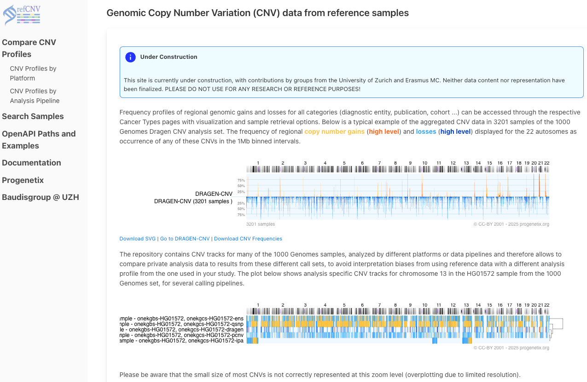
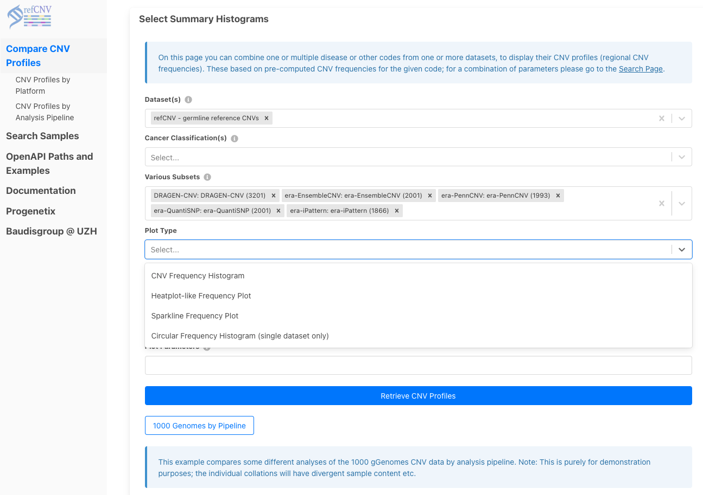
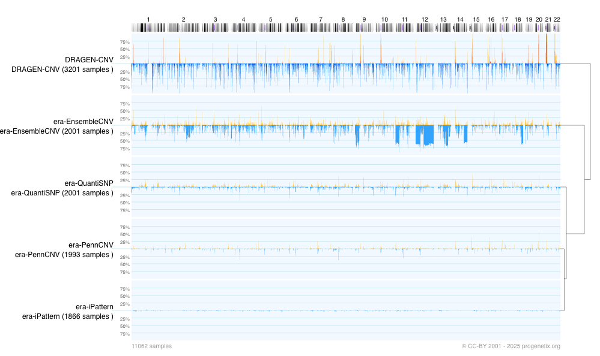
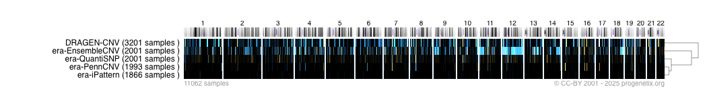
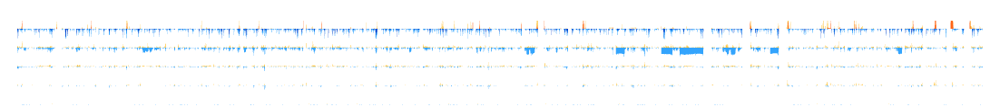
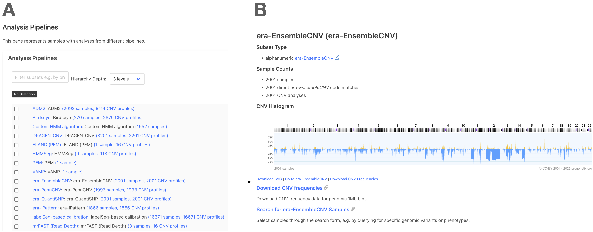
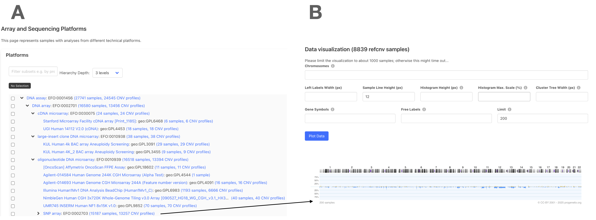

# 🧬 refCNV.org Overview & Use Cases (v2)

refCNV.org provides curated CNV (Copy Number Variation) profiles derived from reference samples, including analyses from multiple pipelines (e.g., DRAGEN-CNV, PennCNV, QuantiSNP). It supports exploratory analysis, visualization, and comparison of CNV data across tools and platforms.

> 🚧 **Note:** This platform is under development and should not be used for clinical or publication purposes at this stage.

---

## 🌐 Homepage Overview

The homepage introduces the concept of regional CNV profiling using reference samples from large projects like the 1000 Genomes. It shows typical frequency plots (e.g., for DRAGEN-CNV) with summary visualizations of gains (orange) and losses (blue).

---

## 📊 Use Case 1: Compare CNV Profiles Across Pipelines

Explore how different CNV calling pipelines produce divergent results for the same sample set.

- Select `refCNV - germline reference CNVs`
- Choose pipelines: DRAGEN, EnsembleCNV, QuantiSNP, PennCNV, iPattern
- Generate output in heatmap, histogram, or sparkline formats

---

## 📊 Use Case 2: Explore Pipeline-Specific Datasets

Use the "Analysis Pipelines" section to browse and visualize all samples processed by a specific CNV calling pipeline.

- Panel A: Select any listed pipeline (e.g., DRAGEN, EnsembleCNV)
- Panel B: View CNV histogram for that pipeline and access download links for SVG and data files
- Inspect sample counts, data origin, and direct search for specific entries

---

## 📊 Use Case 3: Platform-Based CNV Exploration

Use the “Array and Sequencing Platforms” panel to explore CNV patterns derived from specific microarray or sequencing technologies.

- Panel A: Choose a platform subset (e.g., Affymetrix, Illumina, BAC arrays)
- Panel B: Generate CNV frequency histograms across selected platforms
- Adjust settings like histogram height or line width before plotting

---

## 💡 Interpretation Tips

- Pipelines differ in CNV calling sensitivity and precision
- Platforms contribute inherent variability due to probe density and noise
- Use comparative plots to benchmark tools and choose references

---

## 🛠️ Additional Use Cases

- **Single Sample CNV Track Viewer**  
  Visualize one sample across all pipelines

- **Cohort CNV Signature Construction**  
  Create merged profiles by disease or sample group

- **Batch Normalization Evaluation**  
  Compare groups to detect CNV call shifts caused by preprocessing

---

## 📚 Resources

- [refCNV Documentation](https://docs.refcnv.org)
- [OpenAPI Access](https://refcnv.org/openapi.html)
- [Progenetix Database](https://progenetix.org)

---

© CC-BY 2001–2025 progenetix.org
